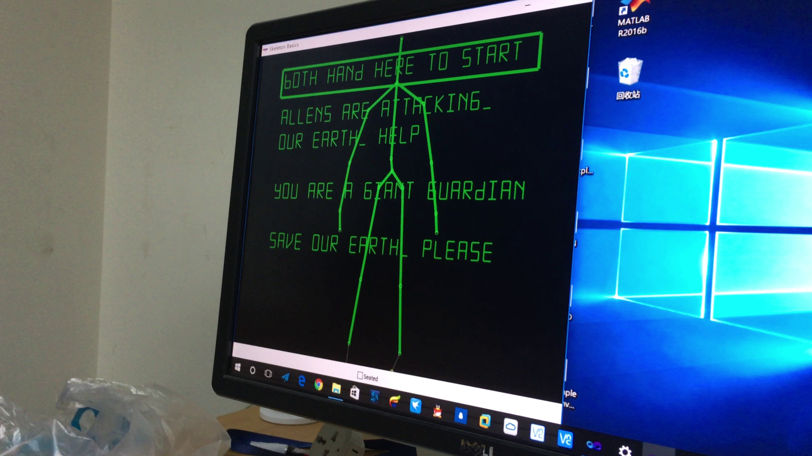
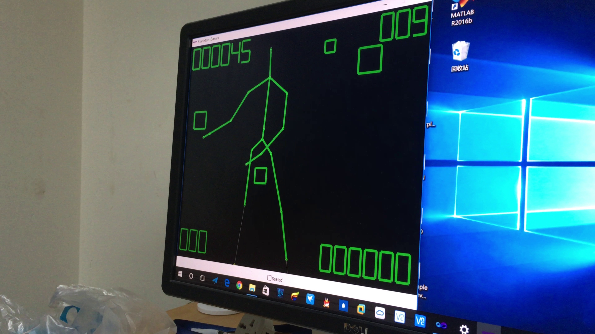
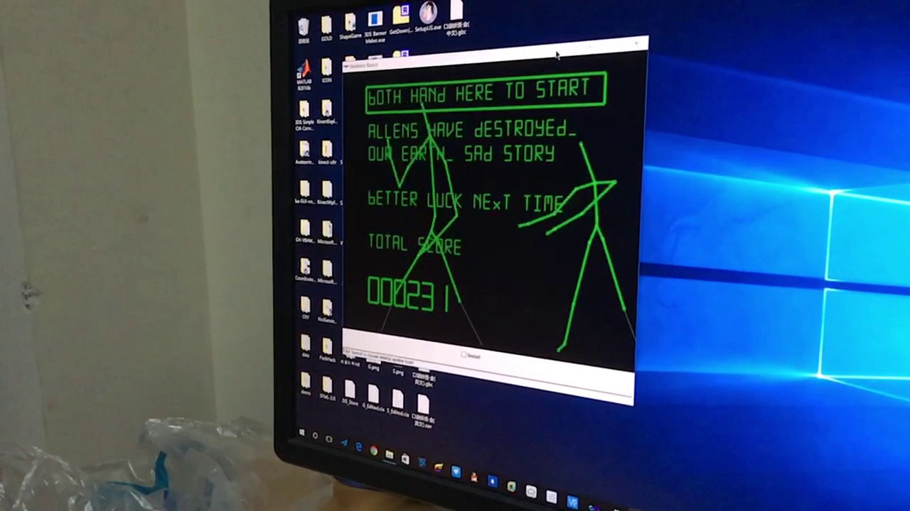
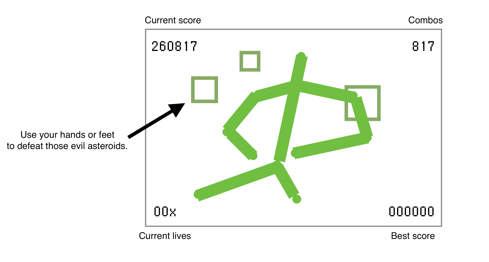

# Portfoilo No.2: A Simple Game using C++, Kinect SDK and Direct2D

## Demo Showcase

- [Video record about the game project on Youtube](https://youtu.be/QMBHE3Dcjvc)
- The screenshots of the game.

	
	
	
		
	
	
## About This Project

This project is made for the final project in computer vision course on the first semester of junior, which uses Kinect SDK v1.0 to make a basic game with C++ and Direct2D.

## About this Game

Allens are intruding our Earth by sending asteroids! You are a giant guardian. Please help people and save our Earth. Use your body motion to hit those asteroids (green boxes).

## Introducing the Game UI

## How to Start the Game

- Put both hands into the green box.
- You can pause the game by putting both hands into the "current score" area.

## Details in this Game

- This game supports 2 player co-up. If so, the asteroids will go even faster!
- You have only 3 lives. When an asteroid hits the ground, you lose a life with a mark of x at the bottom left corner. If you lose all three of them, the game overs.
- An extra life can be earned for every 1000 points.
- The score can go higher more quickly if there's more combo. You lose the combo if you lose one life. BTW, the speed of the asteroids depends on the score and the combo.
- Please enjoy yourselves.

## What I Have Done in This Project
- Overall game design, including the basic idea of the game and all the details about it.
- Font rendering system. I used a very basic method to render fonts in a stylish way.
- Programming the logic of the game. Construction the objects used in the game.

## What I Leared from Others
- The Direct2D code for drawing lines.
- The code used for human body detection.

## Other Resources
- Sound effects are from Super Mario Bros.

## Some Improvements I Could Do
- I was unexperienced with code making for fonts so I used hard-coded for them in a very stupid way. I should just use an 8-bit integer to represent the coding status of each character and use an array to store them. This will make the code a lot more readable.
